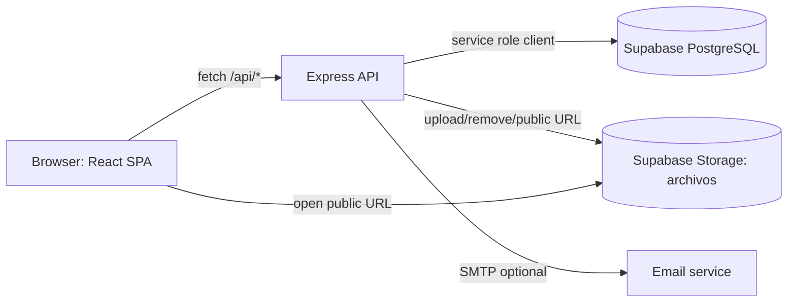
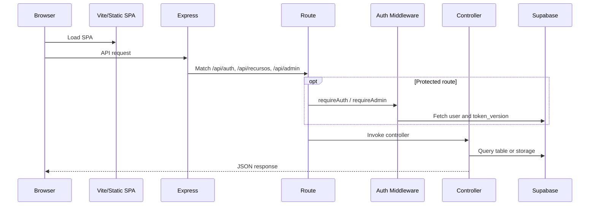
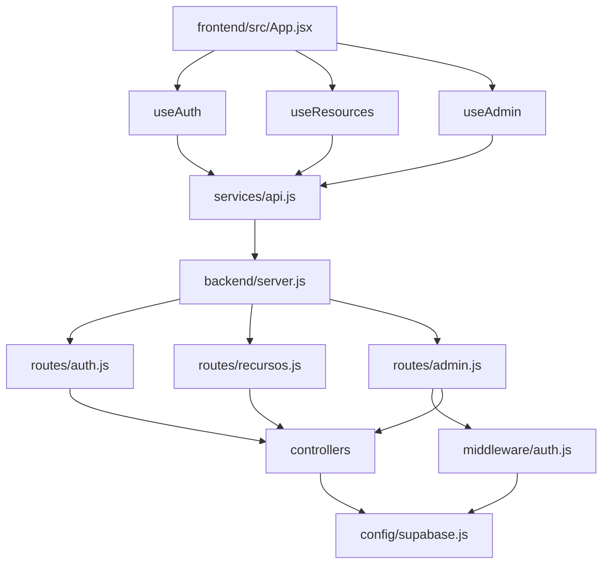

# Architecture

## High-Level System

The frontend is a Vite-built React SPA. The backend is an Express API that can also serve the built SPA from `frontend/dist`. Data and files live in Supabase PostgreSQL and Supabase Storage.

## Runtime Boundaries

| Boundary | Location | Responsibility |
|---|---|---|
| React SPA | `frontend/src` | User interface, client state, API calls, animations |
| API server | `backend/server.js` | Middleware, CORS, routing, static serving, error handling |
| Route layer | `backend/routes` | URL to controller mapping and auth middleware wiring |
| Controller layer | `backend/controllers` | Business logic and Supabase operations |
| Supabase client | `backend/config/supabase.js` | Central service-role Supabase client with env validation |
| Database schema | `database/schema.sql` | Tables, indexes, RLS enabled state |

## Request Lifecycle

## Service Dependency Map

## Routing Model

Frontend routing is manual state in `App.jsx`, not React Router. Backend routing is Express routers under `/api`.

| Route Type | Implementation |
|---|---|
| Frontend pages | `page` state: `home`, `auth`, `admin` |
| Password reset entry | `reset_token` query param forces `auth` page |
| Backend auth | `/api/auth/*` |
| Backend resources | `/api/recursos/*` |
| Backend admin | `/api/admin/*` |

## Why This Architecture Exists

The application is small enough that manual frontend page state avoids router complexity. The backend remains a conventional Express controller stack, and Supabase handles persistence and file storage without a separate database or object storage service.
