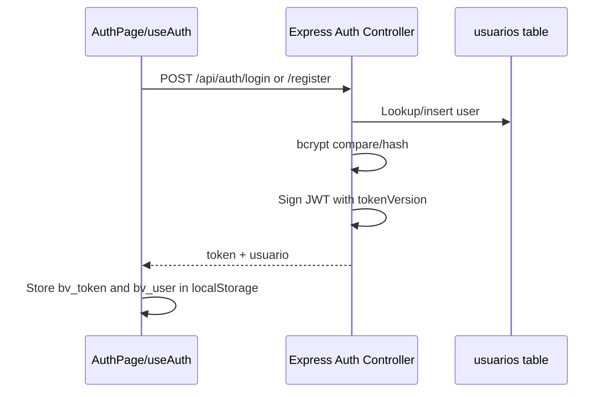
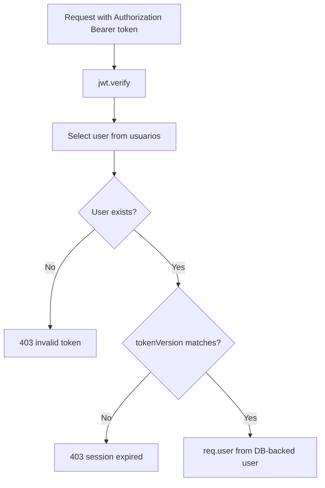

# Auth System

## Credential Flow

## JWT Payload

`authController.signUserToken()` signs:

| Claim | Source |
|---|---|
| `id` | `usuarios.id` |
| `email` | `usuarios.email` |
| `role` | normalized `usuarios.rol` |
| `nombre` | `usuarios.nombre` |
| `tokenVersion` | `usuarios.token_version || 0` |

Expiration is `7d`.

## Session Storage

Frontend keys:

| Key | Storage | Purpose |
|---|---|---|
| `bv_token` | localStorage | JWT |
| `bv_user` | localStorage | Cached user profile |
| `bv_auth` | BroadcastChannel name | Cross-tab logout |

`logout()` removes all keys starting with `bv_` from localStorage and sessionStorage.

## Authenticated Request Flow

## Roles

| Role | Meaning |
|---|---|
| `usuario` | Default registered user |
| `admin` | Can access admin routes and moderate resources |
| `superadmin` | Can access admin routes and change non-superadmin roles |

`requireAdmin` allows `admin` and `superadmin`. `requireSuperAdmin` assumes `requireAdmin` already populated `req.user`.

## Password Reset

- Request endpoint normalizes email and always returns a generic success message for existing/non-existing emails.
- Tokens are random 32-byte base64url strings.
- Only SHA-256 token hashes are stored in `password_reset_tokens`.
- Existing unconsumed tokens for the user are consumed when issuing a new token.
- Confirming reset enforces a stronger password: at least 8 chars, lowercase, uppercase, number.
- Successful reset updates password hash, marks token consumed, updates `password_changed_at`, and increments `token_version`.

## Security Tradeoffs

- JWTs in localStorage are convenient for separate frontend/backend deploys but vulnerable to XSS token theft.
- Reset rate limits use in-memory Maps; they do not survive process restart and do not coordinate across multiple server instances.
