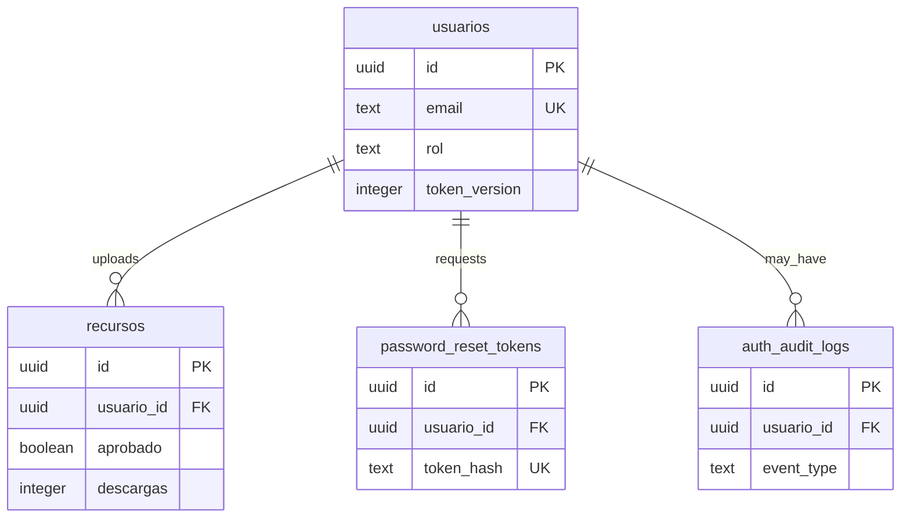

# Database

Source: `database/schema.sql`.

## Tables

### `public.usuarios`

| Column | Type | Notes |
|---|---|---|
| `id` | uuid PK | Default `gen_random_uuid()` |
| `nombre` | text | Required |
| `email` | text unique | Required, normalized in app code |
| `password_hash` | text | bcrypt hash |
| `rol` | text | `usuario`, `admin`, or `superadmin`; default `usuario` |
| `token_version` | integer | Used to invalidate JWTs |
| `password_changed_at` | timestamptz | Set on password reset |
| `reset_token` | text | Legacy, cleared by current reset flow |
| `reset_token_expires` | timestamptz | Legacy, cleared by current reset flow |
| `created_at` | timestamptz | Default `now()` |

### `public.password_reset_tokens`

| Column | Type | Notes |
|---|---|---|
| `id` | uuid PK | Default `gen_random_uuid()` |
| `usuario_id` | uuid FK | Cascades on user delete |
| `token_hash` | text unique | SHA-256 hash only |
| `expires_at` | timestamptz | TTL set by app to 30 minutes |
| `consumed_at` | timestamptz | Null until consumed/expired |
| `requested_ip` | text | Audit metadata |
| `requested_user_agent` | text | Audit metadata |
| `created_at` | timestamptz | Default `now()` |

### `public.auth_audit_logs`

Captures reset-related auth events. `metadata` is JSONB and defaults to `{}`.

### `public.recursos`

| Column | Type | Notes |
|---|---|---|
| `id` | uuid PK | Default `gen_random_uuid()` |
| `nombre` | text | Required |
| `descripcion` | text | Required |
| `categoria` | text | Required |
| `tags` | text[] | Default empty array |
| `archivo_url` | text | Public Supabase Storage URL |
| `archivo_nombre` | text | Original file name |
| `archivo_tipo` | text | Extension uppercased by app |
| `archivo_tamaño` | bigint | File size; accented column name |
| `usuario_id` | uuid FK | Cascades on user delete |
| `descargas` | integer | Non-negative download count |
| `aprobado` | boolean | Default false |
| `created_at` | timestamptz | Default `now()` |

## Relationships

## Indexes

- `idx_recursos_aprobado_created_at`
- `idx_recursos_categoria`
- `idx_recursos_descargas`
- `idx_recursos_usuario_id`
- `idx_password_reset_tokens_usuario_id`
- `idx_password_reset_tokens_lookup`
- `idx_auth_audit_logs_usuario_id_created_at`
- `idx_auth_audit_logs_event_created_at`

## RLS

RLS is enabled for all application tables in schema. The backend uses the service-role key, so server-side operations bypass RLS. RLS still helps protect against accidental public Data API access if policies are configured separately.

## Important Quirk

`archivo_tamaño` uses a non-ASCII column name. Frontend and backend reference this exact spelling. Be careful when writing SQL, JS object properties, or migrations.
