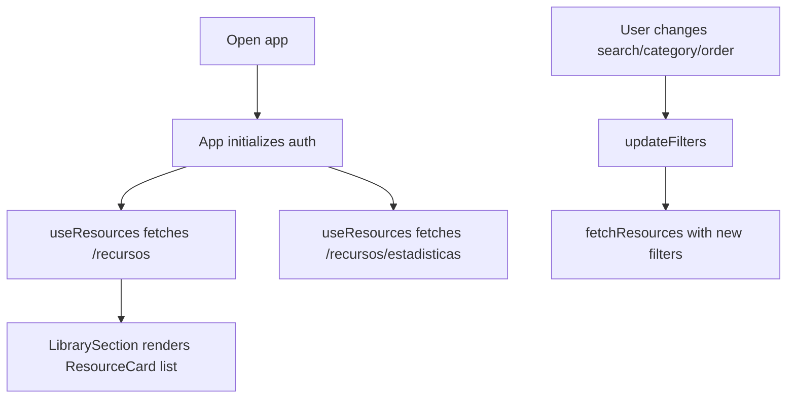
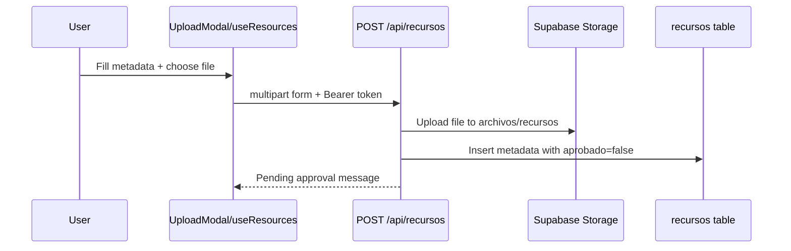
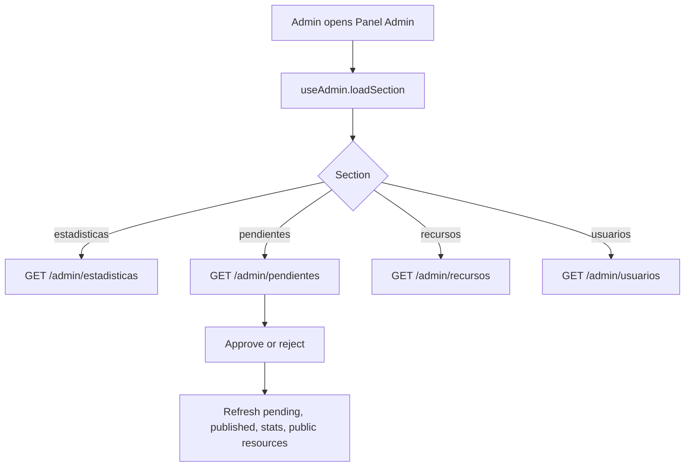

# User Flows

## Browse And Search

## Register/Login

1. User opens auth page from Navbar or upload CTA.
2. `AuthPage` submits to `auth.register()` or `auth.login()`.
3. `useAuth` calls API and stores `bv_token`/`bv_user`.
4. `App` returns to `home` through `onDone()`.
5. Navbar shows user/admin actions based on role.

## Upload Resource

## Download Resource

1. User clicks `Descargar` on `ResourceCard`.
2. `downloadResource(id)` calls `/recursos/:id/descargar`.
3. Backend selects approved resource, increments `descargas`, returns public file URL.
4. Frontend opens URL in a new tab/window.
5. Frontend refreshes resources and public stats.

## Admin Moderation

## Password Reset

1. User opens `¿Olvidaste tu contraseña?` or enters via `/?reset_token=...`.
2. Request step calls `/auth/solicitar-reset` with email.
3. Backend creates hashed token record and sends email if SMTP is configured.
4. Confirm step calls `/auth/confirmar-reset` with token and new password.
5. Backend consumes token, changes password, increments `token_version`.
6. Frontend logs out/clears session and prompts login.

## Logout

Logout clears React auth state, all `bv_` keys in local/session storage, upload/admin state through dependent effects, and broadcasts logout across tabs.
