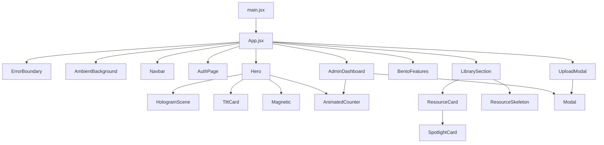

# Components Map

## Hierarchy

## Component Responsibility Table

| Component | File | Responsibility |
|---|---|---|
| `App` | `src/App.jsx` | Root state, page selection, hook composition, modal wiring |
| `Navbar` | `layout/Navbar.jsx` | Auth-aware navigation and upload/admin/logout actions |
| `AmbientBackground` | `layout/AmbientBackground.jsx` | Pointer spotlight and animated background fields |
| `AuthPage` | `auth/AuthPage.jsx` | Login/register/reset forms and sensitive form clearing |
| `AdminDashboard` | `admin/AdminDashboard.jsx` | Admin sections, moderation, role UI, local toast |
| `Hero` | `landing/Hero.jsx` | First-screen content, CTA actions, stats preview |
| `LibrarySection` | `resources/LibrarySection.jsx` | Filters, public stats, resource grid |
| `ResourceCard` | `resources/ResourceCard.jsx` | Single approved resource display and download action |
| `UploadModal` | `resources/UploadModal.jsx` | Upload form and file picker |
| `HologramScene` | `three/HologramScene.jsx` | Three.js animated object, lazy-loaded |
| `Button` | `ui/Button.jsx` | Motion button wrapper using `.btn` classes |
| `Modal` | `ui/Modal.jsx` | Animated overlay/dialog shell |
| `ErrorBoundary` | `ui/ErrorBoundary.jsx` | Catches render errors and offers reload |

## Cross-Cutting UI Patterns

- Components use named exports except `App` default export.
- Motion effects are centralized in `utils/motion.js` and `components/motion` where practical.
- Forms use controlled React state and backend error messages.
- Admin and upload feedback is inline; there is no global toast provider.
- Responsive layout is mobile-first: cards and modals use compact base padding/radius, actions stack on mobile, and desktop density returns through `sm:`, `md:`, `lg:`, and `xl:` utilities.
- Wide admin tables are contained by local `overflow-x-auto` panels so the page itself should not horizontally scroll.

## Large Components

| Component | Reason To Watch |
|---|---|
| `AdminDashboard.jsx` | Contains dashboard plus several table subcomponents and action orchestration |
| `AuthPage.jsx` | Handles four auth/reset states in one component |
| `App.jsx` | Root orchestration plus `BentoFeatures` local component |
