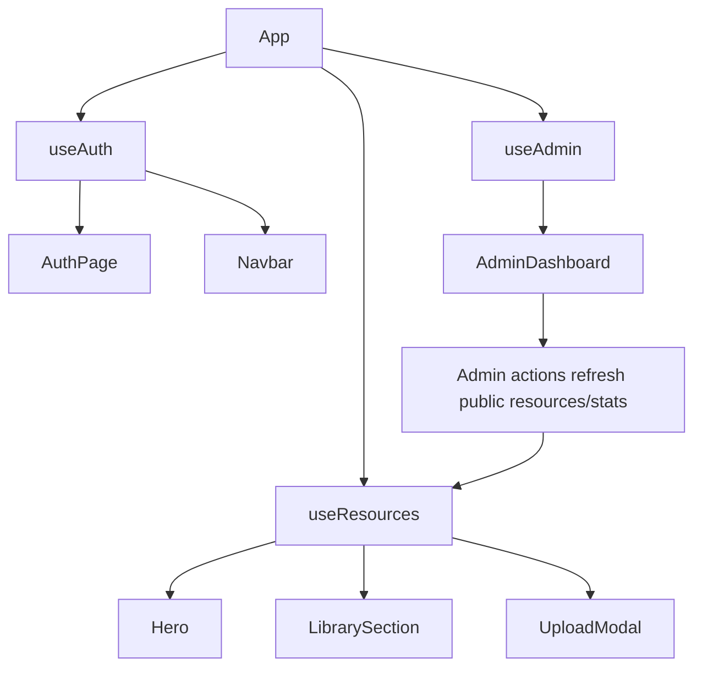

# State Management

The app uses local React hooks and prop passing. There is no Redux, Zustand, React Query, or router state library.

## Root State

`App.jsx` owns:

| State | Purpose |
|---|---|
| `resetTokenFromUrl` | Initial password reset token from query string |
| `page` | Manual route: `home`, `auth`, `admin` |
| `uploadOpen` | Upload modal visibility |

`App.jsx` composes `useAuth`, `useResources`, and `useAdmin`, then passes hook state/actions down to page components.

## Custom Hooks

| Hook | Owns | API Dependencies |
|---|---|---|
| `useAuth(token/user)` | JWT, cached user, auth errors/loading, initialization, session version | `/auth/*` |
| `useResources(token)` | Approved resources, public stats, filters, upload state | `/recursos/*` |
| `useAdmin(token,isAdmin,isSuperAdmin,...)` | Admin stats, pending, published, users, admin loading | `/admin/*` |
| `usePrefersReducedMotion()` | Media query boolean | Browser `matchMedia` |

## State Flow

## Refresh Patterns

- `useAuth.refreshProfile()` runs once on mount to validate persisted tokens.
- `useResources.fetchResources()` runs on mount and when filters change.
- `useResources.fetchPublicStats()` runs on mount and after upload/download/admin changes.
- `useAdmin.loadSection(section)` loads the active admin section on section changes.
- Admin mutations refresh multiple caches with `Promise.all`.

## Important Implementation Details

- `useResources` uses `filtersRef` so `fetchResources()` can read latest filters without stale closures.
- `useAuth` uses `sessionVersion` to force sensitive form reset after login/logout/reset.
- Logout broadcasts through `BroadcastChannel` and listens for localStorage changes as fallback.

## Risk Areas

- `useAdmin` receives refresh callbacks from `useResources`; changing their identity can cause extra reloads.
- Manual page state makes deep-linking and browser back/forward behavior limited.
- API fetches are hand-rolled; there is no request deduplication, caching library, retry, or cancellation.
