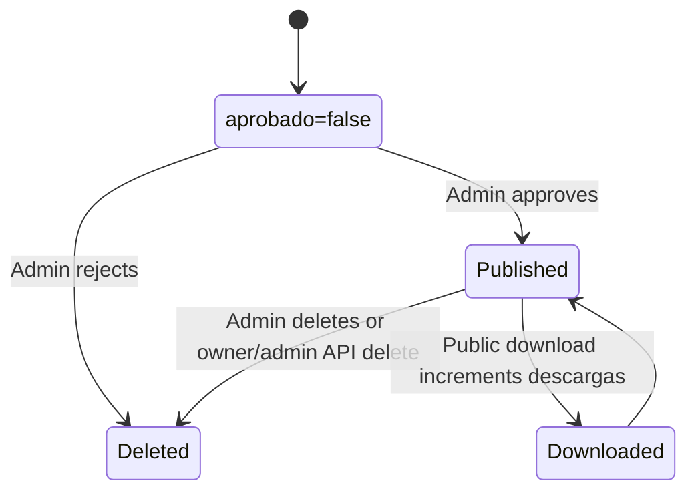

# Business Logic

## Resource Lifecycle

## Resource Rules

| Rule | Enforced In |
|---|---|
| Upload requires login | `routes/recursos.js` with `requireAuth` |
| Upload requires `nombre`, `descripcion`, `categoria`, `archivo` | `recursosController.subir` |
| Uploaded resources are pending by default | `recursosController.subir` inserts `aprobado: false` |
| Public listing/details show only approved resources | `recursosController.listar/obtener` |
| Downloads only work for approved resources | `recursosController.descargar` |
| Download increments `descargas` | `recursosController.descargar` |
| Admin approval publishes resource | `adminController.aprobar` |
| Reject/delete removes Storage file when path can be derived | `adminController`, `recursosController.eliminar` |

## User And Role Rules

| Rule | Enforced In |
|---|---|
| New users get role `usuario` | `authController.register`, DB default |
| Admin routes require `admin` or `superadmin` | `routes/admin.js` + `requireAdmin` |
| Role changes require `superadmin` | `routes/admin.js` + `requireSuperAdmin` |
| Role changes only allow `usuario` or `admin` | `adminController.cambiarRol` |
| Superadmin role cannot be modified from panel | `adminController.cambiarRol` |

## Password Rules

- Registration accepts passwords of at least 6 characters.
- Password reset requires at least 8 characters with lowercase, uppercase, and a number.
- Password reset invalidates existing sessions by incrementing `token_version`.

## Search And Categorization

- Categories are free text in the database.
- Frontend category chips use fixed values: Diagnóstico, Redes, Programación, Mantenimiento, Seguridad, Plantillas.
- Upload modal also allows `Otro`.
- Search uses `ilike` on resource `nombre` only.

## Business-Critical Files

- `backend/controllers/recursosController.js`: publishing and download behavior.
- `backend/controllers/adminController.js`: moderation and role workflows.
- `backend/controllers/authController.js`: login/reset/session invalidation.
- `frontend/src/hooks/useAuth.js`: client auth persistence and logout cleanup.
